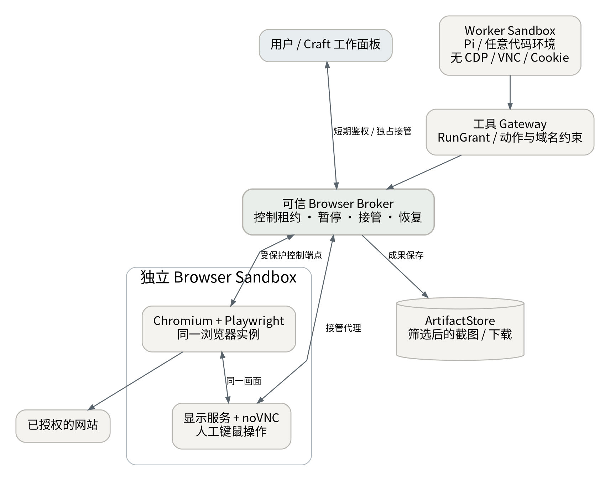

# AgentAnywhere｜MVP 实施与验收文档

版本：v1.0 · 2026-09-18  
状态：建议实施基线；实现任务及验收合同  
对应：PRD v1.0；控制面部署于自有 VPS

> 交付一个经过实际裁剪的 Craft 风格 WebApp，完成从委托到隔离执行、询问/审批、浏览器接管、成果保存和资源回收的闭环。

## 0. MVP 固定决策

| 项目 | 决定 |
| --- | --- |
| 使用者 | 一个所有者、一个默认工作空间；不做公开注册、团队与计费 |
| 主工程 | 基于 Craft 固定提交建立精简派生工程，不先重写 UI，也不整包保留 |
| 前端 | React + TypeScript；沿用适用的 Craft 样式、Jotai、消息和预览组件 |
| 后端 | Craft 服务端可复用部分 + 新业务模块；API/实时服务沿用 Bun 基线 |
| 任务处理 | 独立队列进程使用与选定 pg-boss 版本匹配的 Node.js；共用业务包，不假设 Bun 已通过所有队列兼容测试 |
| 数据 | 一个 PostgreSQL；文件持久卷保存成果与检查点；数据库是业务事实源 |
| Harness | Pi；使用 Craft 基线的集成与兼容版本，不自动升级最新 SDK |
| Sandbox | OpenSandbox 的 Docker 后端；一个 Endpoint，多个逻辑 Profile |
| Browser | 独立 Sandbox + Playwright + Browser Broker + noVNC 人工接管 |
| Connector | 一个自托管 OpenConnector；业务 Gateway 执行 Run 级约束 |
| 模型 | 只接 sub2api；保留端点、模型、参数和连接测试 |
| 默认并发 | 一个活跃 Worker Run，可附带一个 Browser Session；子任务排队 |
| Cloudflare | 保留适配契约与失败能力测试，不作为 MVP 生产部署必需项 |

本文件中的路径为两类：标有“上游”的路径来自核查的 Craft 源码；标有“目标”的路径是本项目拟建立的组织结构。接口与状态机均为项目设计，不冒充现有 SDK 的原生 API。

## 1. 发布闭环与明确排除项

### 1.1 必须跑通的五个用户闭环

| 编号 | 闭环 | 最小可用结果 |
| --- | --- | --- |
| C1 | 调研 → 报告 | 管家分派 Research Agent，获取来源、形成 Markdown 和引用，沙箱销毁后可读 |
| C2 | 开发 → 测试 → Patch | 在隔离工作目录修改样例仓库，执行测试，保留 diff、测试结果和可选预览 |
| C3 | 身份读取 → 审批写入 | 真实账号读取受限资源，确认具体内容后执行一次写入，保存上游回执 |
| C4 | 浏览器 → 人工接管 → 成果 | 打开动态页面，提取/截图/下载；接管、暂停自动操作、恢复或人工结束 |
| C5 | 定时检查 → 变化分析 | 保存时区和游标；重复触发去重；无变化不调用模型，有变化产生工作与站内通知 |

C3 优先使用用户自有 GitHub 测试仓库；实现前从 OpenConnector 实际目录确认读取与创建 Issue 的 Action、认证方式和 Schema。不得把 UI 示例中的 Action 名称视为已验证可执行接口；缺失时需补一个可测试的连接器 Action，不能用 mock 冒充真实写入闭环。[R15]

### 1.2 不进入首版

不接多个 Harness；不保留 Claude/Codex 专属账号登录；不做 Agent 市场、公开会话分享、WhatsApp/Slack 等消息渠道、复杂 DAG、全功能终端工作台、任意网站无人监督发布、跨云内存迁移、登录态跨任务自动继承。

不会因首版复用 Craft，就顺带发布其全部功能。所有新需求先判断是否服务于 C1—C5 或安全/可靠性门槛。

## 2. 架构与部署边界


### 2.1 常驻与按需组件

| 组件 | 部署位置 | 常驻/按需 | 说明 |
| --- | --- | --- | --- |
| Web 静态资源 + HTTPS 入口 | VPS | 常驻 | 只公开 Web/API 和鉴权后的实时入口 |
| App / Control API | VPS | 常驻 | 会话、管家、业务状态、授权、审批、成果、事件 |
| Queue Worker | VPS | 常驻 | pg-boss、派遣、续租、核对、回收、定时触发 |
| Browser Broker | VPS 可信服务 | 常驻逻辑模块 | 不含长期运行 Chromium；持有受限浏览器控制入口 |
| PostgreSQL | VPS 私有网络 | 常驻 | 业务表、事件表、队列表；备份 |
| OpenConnector | VPS 私有网络 | 常驻 | 账号与第三方 Action，管理入口不向 Agent 暴露 |
| OpenSandbox Server | VPS 受信任节点 | 常驻 | 唯一可管理 Docker 的服务之一；管理接口不公开 |
| Pi Agent Worker | Worker Sandbox | 按 Run 创建 | 固定工具与 Skill、工作目录、受限 token |
| Chromium / Playwright / 显示服务 | Browser Sandbox | 按需创建 | 无通用代码工具；短期会话、独立目录 |
| Cloudflare bridge / Sandbox | Cloudflare | 后续 | 官方 bridge 由用户账号自部署，不迁移控制面 |

这些是职责和进程边界，不是要求九个新建微服务。App、Gateway、Browser Broker 可以共享一个服务工程；Queue Worker 作为第二个入口进程。OpenSandbox 和 OpenConnector 保持独立上游服务，减少 fork 维护面。

### 2.2 网络与凭证

浏览器和 Worker 不进入数据库/连接器管理网段。Docker socket 只给可信 Sandbox 管理服务，不能挂载到工作容器。Worker 只访问模型转发入口、工具 Gateway、事件与文件上传入口及明确允许的外网。

Browser Broker 才能访问浏览器控制端点；Web 用户通过一次性短期授权进入 noVNC，不能直接使用裸 VNC/CDP 地址。预览、下载与应用控制面按来源隔离，下载不自动执行。

sub2api 继续是模型路由事实源。为避免主模型密钥进入任意 shell 环境，可由一个薄模型转发入口验证 Run token 后注入 sub2api 凭证；该入口不新增路由策略或第二套模型目录。

## 3. Craft 最小派生工程与物理裁剪

### 3.1 上游基线与迁移顺序

固定 Craft v0.13.3、提交 e8963854c3679edcceb105a42537a06749e6cb64；记录上游来源与许可证，建立 vendor/upstream-manifest.json。首先能运行原生 WebUI 和 Pi 连接，再逐层裁剪。[R01][R02]

上游 apps/webui/src/App.tsx 依赖浏览器 API 适配并加载 renderer；WebUI 构建复用 apps/electron/src/renderer。先抽取公共 renderer、transport、类型与资源，再删除 desktop 代码，不能反向操作。[R03][R04]

### 3.2 保留 / 改造 / 删除清单

| 上游范围 | 动作 | 目标与完成条件 |
| --- | --- | --- |
| packages/ui、适用的 packages/core | 保留并压缩依赖闭包 | 消息卡、Markdown、diff、文件预览、样式可独立用于 Web |
| apps/electron/src/renderer | 按功能迁出 | 到目标 apps/web 与 packages/workbench-ui；删除桌面按钮与未用页面 |
| apps/webui 的 adapter 与 transport 依赖 | 改造 | 使用明确 PlatformServices/API 接口；逐步消除 window.electronAPI 命名及桌面空实现 |
| packages/shared 模型、配置、Skill、事件部分 | 按模块抽取 | 避免通过根 barrel import 引入整个 shared |
| packages/pi-agent-server、PiEventAdapter | 保留核心并封装 | 只支持 Pi；进程启动改在 Sandbox 内，不在 VPS 宿主机运行任务 |
| packages/server / server-core | 按模块保留 | 认证、WebSocket、适用工具；任务状态统一接入新服务 |
| Electron main/preload、打包、签名、更新器 | 物理删除 | 无构建脚本、依赖或服务器调用残留 |
| apps/cli、公开 viewer/分享相关实现 | 物理删除未用产品部分 | 不对外提供旧产品入口；内部调试脚本可另留 |
| messaging-gateway、WhatsApp 等渠道 | 删除 | 主产品仅站内；配置与依赖一并去除 |
| Claude/Copilot 等非 Pi backend 与登录流程 | 删除自有适配层和直接依赖 | 只剩 sub2api 所需的 Pi 模型连接；不硬拆 Pi 自身包内通用支持 |
| telemetry、桌面系统服务、营销资源 | 审核删除 | 无未经配置的上游遥测、品牌服务请求或更新检查 |
| i18n、图标、预览渲染 | 选择性保留 | 中文可用、键盘操作和必要 UI 不退化；不因裁剪破坏可访问性 |

此表是执行方案，不声称所有路径已完成迁移。未用功能的服务端 handler、RPC 通道、菜单、Schema、环境变量、测试入口、安装脚本都需纳入删除检查。

### 3.3 裁剪验收

发布依赖不下载 Electron；前端不包含可到达的 Electron/Node 特权模块；容器镜像只包含当前应用所需工具。构建分析报告列明保留包、删除包和剩余传递依赖原因，不承诺未经测量的“裁剪百分比”。

对浏览器控制、控制面 host exec、旧分享链接和外部渠道做负向测试。未实现端点返回明确错误，不保留可调用但无 UI 的遗留通道。

维护 UPSTREAM.md、THIRD_PARTY_NOTICES 与补丁清单；按发布基线选择性合入上游安全/缺陷修复，而不是持续追随全部功能变更。

## 4. 目标代码组织

```text
apps/
  web/                   # Craft 派生 WebApp
  control/               # API / 实时连接 / 受限管家
  queue-worker/          # 调度、续租、核对、自动化
  agent-worker/          # Sandbox 内 Pi 入口
packages/
  workbench-ui/          # 抽取的 Craft 界面与平台适配
  domain/                # Task、Run、Grant、Operation、Artifact
  run-protocol/          # JSON Schema、消息、事件、版本协商
  harness-pi/            # Craft/Pi 适配；版本锁定
  sandbox-contract/      # 中立契约、能力与错误
  sandbox-opensandbox/   # 首版适配
  sandbox-cloudflare/    # 后续入口；首版仅契约/探针说明
  tool-gateway/          # 授权、审批、操作审计
  connector-adapter/     # OpenConnector 接入
  browser-broker/        # 浏览器工具、接管、端点鉴权
  storage/               # PostgreSQL + ArtifactStore
specs/                   # 协议定义、契约测试夹具
infra/                   # Compose、镜像、网络、迁移、备份
```

模块可以合并物理目录，但职责不得混淆；不要为了“分层”创建每包一个服务。sandbox-cloudflare 中的未实现 Provider 必须不可选择，禁止空实现假成功。

## 5. Sandbox 推荐与可扩展契约

### 5.1 首版实现

使用 OpenSandbox Server 的 Docker 模式，调用官方 SDK/HTTP 能力。自定义 Profile 只传允许的镜像、CPU/内存/临时空间、网络策略和生命周期，Agent 不能填写任意 host mount、privileged、Docker socket 或宿主机网络参数。[R07][R08]

Linux VPS 优先验证 gVisor；不需要一开始部署 Kubernetes、Kata 或 Firecracker。浏览器兼容性与安全配置必须实际验证。无法运行目标隔离配置时应停用相应 Profile 或仅作为显式接受风险的本地/单用户测试模式，不默默切回更高权限。[R09]

### 5.2 协议分层

应用调用 SandboxAdapter 的中立方法；OpenSandboxAdapter/CloudflareAdapter 分别映射真实 HTTP API。中立对象以 JSON Schema 版本化，可生成 TypeScript 类型。MVP 不额外部署一个“统一沙箱转发平台”。

| 方法 | 输入关键字段 | 输出/语义 |
| --- | --- | --- |
| capabilities | providerId | 能力集合、版本、限制和支持的 Profile |
| create | requestId、profileId、role、runId、epoch、ttlSeconds | sandboxId、providerResourceId、状态；同 requestId 不能重复分配 |
| inspect | sandboxId | 实际状态、到期时间、资源信息；失联不等于不存在 |
| startProcess | sandboxId、operationId、argv、cwd、envRefs | processId；长进程不绑定一次 HTTP 响应寿命 |
| processStatus / stopProcess | sandboxId、processId | 退出码/运行态；停止具幂等性 |
| readFile / writeFile | sandboxId、workspacePath、内容或传输引用 | 仅工作目录内，检查路径和符号链接 |
| resolveEndpoint | sandboxId、service、accessPolicy | 受保护的服务引用；不默认公开端口 |
| renew | sandboxId、expectedLeaseVersion、ttlSeconds | 新到期时间或冲突；不覆盖更高 epoch |
| destroy | sandboxId、requestId | 可重复调用；清理完成可核查 |

最小必需能力为 lifecycle、backgroundProcess、files、protectedServiceEndpoint。终端、原生快照、暂停、桌面显示、GPU 为可选能力。续租不可用时可由固定时限租约表达，但不得声称执行时间已延长。

### 5.3 Profile 初始值

| Profile | 包含 | 初始资源/限制（待容量验证） |
| --- | --- | --- |
| worker-basic | Pi Worker、文本处理、受控工具客户端 | 1 vCPU 上限，1536 MiB，工作目录 2 GiB |
| worker-coding | 上述 + Git、Node/Python 与测试工具 | 2 vCPU 上限，按任务明确提高内存和工作空间 |
| browser-interactive | Chromium、Playwright/MCP、显示/VNC 组件 | 2 vCPU 上限，2560 MiB，独立下载与 Profile 目录 |

镜像按 digest 固定，命令入口固定；不在每次启动时运行 npx latest 下载。实际浏览器/Playwright 版本对应，避免协议不兼容。[R12]

### 5.4 Cloudflare 的延后支持

官方 bridge 已可供 VPS 中的 HTTP 客户端调用；未来无需迁移控制服务。Cloudflare 镜像由对应部署配置构建，Profile 映射到已部署环境，不能假设逐请求可传入任意 Docker 镜像。[R10]

MVP 必须交付 Provider 契约测试、第二个 fake Provider 的不支持能力测试，以及 Cloudflare API 映射清单。真实 Cloudflare 验证是扩展发布门槛，不占用当前用户账号或预算，也不声称现已兼容。启用前必须验证长进程、回调联网、文件、端点鉴权、取消、销毁；browser-interactive 另做验证，不能继承 worker-basic 的通过结果。

## 6. Run / Agent 协议

### 6.1 传输

Worker 由 Sandbox 启动后主动通过 HTTPS/WSS 注册，只带一次性注册 token；服务端验证 sandboxId、runId、epoch 后换取短期 Run token。控制命令与事件使用独立逻辑通道，重连后根据游标补发。

```json
{
  "protocolVersion": "1.0",
  "runId": "run_...",
  "epoch": 1,
  "eventId": "evt_...",
  "producerSeq": 42,
  "type": "tool.completed",
  "occurredAt": "2026-09-18T00:00:00Z",
  "payload": { "toolCallId": "call_...", "resultRef": "artifact_..." }
}
```

serverSeq 由控制面提交事件时分配。唯一键为 runId+epoch+producerSeq，eventId 另作幂等索引；确认回执只在数据库提交后发送。前端以 serverSeq 重放，不能按本机时间猜顺序。

### 6.2 必需命令与事件

| 方向 | 集合 |
| --- | --- |
| 控制 → Worker | run.start、message.steer、message.follow_up、run.cancel、run.resume_context |
| Worker → 控制 | worker.ready、heartbeat、message.delta、message.completed、tool.started/updated/completed、interaction.requested、checkpoint.ready、artifact.proposed、run.finished、run.failed |
| 控制生成 | interaction.resolved、operation.state_changed、artifact.committed、run.state_changed、lease.state_changed |

只标准化产品需要的事件；保留 source=harness/pi 和安全的原始载荷引用用于调试。不要把所有 Pi 内部类型作为外部协议强制长期兼容。[R05][R06]

### 6.3 交互与恢复实现

request_user_input / propose_external_action 返回持久化 Interaction/Operation 引用，并在可保存的工具边界结束当前回合。平台随后进入 waiting；不能把一个任意 JavaScript Promise 挂在那里，再承诺重启后恢复其调用栈。

审批通过后由可信 Gateway 执行已固定的 Operation，结果作为新的工具结果/上下文注入后续 Pi 回合。Worker 不自行持有“已批准就能随意改参数”的执行许可。

安全检查点包含 Pi Session 数据、工作目录 manifest、当前任务摘要、挂起 Interaction/Operation 引用和配置版本。上传完整、hash 验证和数据库提交后才标为可恢复。恢复前先核查外部副作用，再重建环境并增加 epoch。

旧 epoch 的命令、事件和 token 不再改变业务状态；已发出且无法撤销的外部请求仍按 Operation 核查，不因 fencing 就假设它不存在。

## 7. 持久化与状态机

### 7.1 最小表集合

| 表/对象 | 主要字段与约束 |
| --- | --- |
| tasks | id、owner_id、parent_id、goal、acceptance_json、status、version |
| runs | task_id、agent_version_id、status、wait_reason、epoch、grant_id、retry_of、budget、checkpoint_ref |
| agent_definitions / agent_versions | name、配置 JSON、version、content_hash；运行引用不可变版本 |
| messages / run_events | thread_id、run_id、server_seq、event_id、body/reference；事件去重约束 |
| run_grants | connection IDs、Action/资源限制、browserMode、版本、有效期、撤销状态 |
| interactions | run_id、kind、payload_hash、status、answer、expires_at |
| operations | run_id、connection_id、action_id、resource、input_hash、idempotency_key、state、receipt |
| sandbox_leases | provider、provider_resource_id、role、run_id、epoch、expires_at、cleanup_state |
| artifacts / artifact_versions | logical_id、kind、path、hash、size、source_run、verification、retention |
| browser_sessions | run_id、lease_id、mode、controller、control_epoch、state_ref |
| automations / trigger_receipts | schedule、timezone、template_version、cursor、dedupe_key、last_result |
| secrets / connection_refs | 加密值或连接引用、安全展示字段；普通 API 不返回秘密 |
| outbox | 事务提交后的派遣、通知、取消与状态传播任务 |

pg-boss 自身队列表与业务 runs 分离。会话渲染是业务数据的投影；不并行保留一个能独立决策 Task 完成的旧 SessionManager 状态机。Pi JSONL 是运行检查点/上下文，不是授权和外部写入的唯一事实源。

### 7.2 Run 状态

queued → provisioning → running → finalizing → succeeded。running 可进入 waiting；回答后回到 running，必要时经 provisioning 重建环境。异常可进入 failed、cancelled、lost；lost 为待核查，不是自动重试信号。

finalizing 中核验成果、保存结果、记录 Operations。成功状态与 Sandbox cleanup_state 分开：清理失败不应丢失已经完成的成果，也不能不提醒资源残留。

### 7.3 Operation 状态

proposed → awaiting_approval → approved → executing → succeeded。其他结果为 denied、expired、failed、unknown。executing 超时优先 unknown；只有明确未发生时才允许安全重试。已经 succeeded 的 Operation 在同一任务重试时仍被引用，不再次执行。

## 8. 工具 Gateway、OpenConnector 与审批

### 8.1 工具发现与执行

首次连接后从 OpenConnector 拉取必要目录与 Schema，保存版本快照。只向本次 Run 暴露已授权工具；工具参数由上游 Schema 生成/校验，资源范围由本项目另行限制。[R15]

MVP 外部写操作走 Gateway → OpenConnector HTTP Action；Agent 不持有 OpenConnector 管理 token 或 bootstrap token。即使 shell 构造原始 HTTP 请求，也必须经过同一个授权入口。

选定一个账号引用后，调用时始终显式指定映射的连接；找不到时拒绝，不回退默认账号。禁止把所有平台 token 放到同一个 Worker 环境里。

### 8.2 审批关键流程

> 图 2：执行与审批流程图尚未提供；当前以正文流程和状态定义为准。

Gateway 保存规范化输入、账号、资源、inputHash、grantVersion、expiry 和 operationId。用户在 Craft 风格卡片中看到真实内容与附件预览。审批通过以事务/条件更新消费一次许可，再派发执行。

重复 HTTP 重试复用同一个幂等键；内容变化生成新 Operation。调用结果包含上游 ID/URL、时间、状态和必要的脱敏响应。网络状态不明时先查询上游；无法核实时进入“待我核查”，不能只凭超时判断没有发生。[R15]

### 8.3 控制面接口（拟定）

| 接口 | 行为 |
| --- | --- |
| POST /api/tasks | 创建工作；支持客户端 requestId 去重 |
| GET /api/tasks/:id | 目标、运行、成果、待办与子任务摘要 |
| POST /api/tasks/:id/runs | 启动/重试；新 Run 固定版本与授权 |
| POST /api/runs/:id/messages | steer 或 follow_up；命令带 commandId |
| POST /api/runs/:id/cancel | 持久化取消、撤销新动作授权、发送停止命令 |
| POST /api/interactions/:id/resolve | 回答/审批/拒绝；必须验证内容哈希和版本 |
| GET /api/runs/:id/events?after= | SSE/批量回放；与现有 WS 投影共用数据库 |
| GET /api/artifacts/:id | 受鉴权的元信息与下载入口 |
| POST /api/browser-sessions/:id/takeover | 获取独占人类控制租约和短期接管会话 |
| POST /api/browser-sessions/:id/release | 释放接管；重新观察后再允许 Agent 继续 |
| /api/settings/* | Agent、模型、账号、Skill、Secrets、Profiles、预算的受控管理 |

接口鉴权、CSRF、Origin 与 WebSocket 握手检查不能因“个人使用”省略。管理设置和浏览器控制都是高权限操作。

## 9. 浏览器实现与接管

### 9.1 物理边界



Browser Sandbox 内运行 Chromium、Playwright/MCP 和需要的显示组件；同一个被操作浏览器对应可见画面。VNC 客户端必须看到 Agent 操作的真实实例，不能用另开浏览器模拟接管。

Browser Broker 连接受保护的 MCP/CDP/显示端点，暴露业务授权后的工具。Agent Worker 没有浏览器容器的 shell、CDP、Profile 目录或裸 MCP 地址。两个 Sandbox 可以在同一个 VPS，但必须有网络和文件隔离。

### 9.2 工具与模式

| 模式 | Agent 能力 | 用户能力 |
| --- | --- | --- |
| anonymous | 对授权的公开域名导航、快照、点击链接/分页、截图、允许的下载；受限测试表单 | 可随时接管 |
| human_control | 不允许任何新浏览器动作；挂起/取消在途动作 | 登录、MFA、验证码、敏感表单和最终提交 |
| authenticated_observe | 用户结束接管后明确允许的当前页观察、截图/提取；不开放通用写动作 | 再次接管、最终提交、结束会话 |
| site_adapter（后续） | 经审核站点的固定动作与参数；批准后执行 | 针对具体账号、对象、内容审批 |

anonymous 不意味着网络动作绝对无副作用；首版禁止泛化提交表单和不可识别动作，测试表单仅在明确授权测试站点启用。不要声称一个通用 DOM 点击分类器足以保证“只读”。

不向有登录态的通用 Agent 开放 arbitrary evaluate、run_code、任意请求接口或原始 CDP。官方 MCP 的网络配置仅是辅助，网络隔离仍由运行环境/可信出口强制。[R11]

### 9.3 接管状态机

agent_controlled → takeover_requested → quiescing → human_controlled → resuming → agent_controlled 或 authenticated_observe。

Broker 用 controlEpoch/租约确保单写者。接管确认前拒绝新的 Agent 动作；退出接管后使旧定位引用失效，重新获取页面信息。会话断连不立即把控制交回 Agent，须用户确认或超时停用。

登录过程中暂停采集。MVP 不跨 Run 自动存储登录态；用户可在同一 Run 中继续观察与接管。后续增加 encrypted storageStateRef、站点绑定、过期、撤销和独占 Profile 使用；认证状态文件可能包含可冒用身份的 Cookie，不能进入 Git 或普通成果。[R13]

### 9.4 UI 与产物

工作右侧面板包含当前 URL、连接状态、关键截图、接管按钮、已下载文件、当前控制者和结束会话按钮。noVNC 嵌入统一外框，不保留另一套产品导航；其键鼠和图像传输不是任务进度事件。[R14]

下载先进入隔离目录，设置大小上限和 MIME 检查；保存为 Artifact 前不自动执行或打开宏。HTML 预览与控制面独立来源，浏览器不得拿到控制面会话 Cookie。

## 10. 文件、检查点与恢复

ArtifactStore 提供 put/get/stat/delete；首版由 VPS 持久卷实现，路径由服务器生成，不接受模型给任意宿主机绝对路径。写入过程为临时文件 → hash/大小校验 → 原子提交 → 数据库版本记录。

检查点必须有 manifest、状态版本和完整标志；保存失败不回收唯一现场。长时间 waiting 时，只在明确安全边界保存并回收；浏览器活跃连接、后台测试进程和内存状态不承诺恢复。

恢复先查询 Operation，解决 unknown 状态，再创建新环境与 epoch，挂载/恢复允许文件，注入已完成动作回执和用户回答。不能通过让模型重新“想一遍”替代恢复逻辑。

MVP 首个恢复用例是问题/审批等待后的恢复，不要求任意时刻透明迁移。非检查点崩溃允许丢失尚未被服务器确认的最近文本片段，必须显示“部分输出未保存”，不能假装完整记录。

## 11. 队列、租约、预算与自动化

### 11.1 调度

pg-boss 负责 durable jobs，业务数据库使用事务/outbox 保证创建 Task/Run 后最终派遣。队列语义不等于第三方副作用恰好一次；createSandbox、注册 Worker、Operation 执行都要自己的幂等与核查。[R16]

作业类型收敛为 dispatch、cancel、reconcile、cleanup、resume、automation.check。长 Run 不占据一个必须持续存活的队列作业：派遣后结束作业，通过事件和周期核对推进。

### 11.2 建议初始参数（配置值，不是上游默认值）

| 参数 | 初始值 | 行为 |
| --- | --- | --- |
| Worker 心跳 | 15 秒 | 连续丢失后核查，不能立即并发重建 |
| 运行租约 | 120 秒，周期续租 | 过期后 Gateway 拒绝新特权操作；环境按策略停用 |
| Run 最大活跃时长 | 45 分钟 | 到达后停止/保存，用户可显式提高 |
| 普通等待保温 | 10 分钟 | 安全检查点成功后回收；不能保存则提示并按硬上限终止 |
| 浏览器接管闲置 | 5 分钟提示，10 分钟结束会话 | 登录态默认不跨 Run 保存 |
| 默认模型轮次上限 | 40 轮 | 不含确定性变化检查；达到后请求继续或结束 |
| 事件批量持久化 | 最长 500 毫秒 | 审批、操作状态、最终结果需立即事务提交 |
| Worker 并发 / 浏览器并发 | 1 / 1 | 依据资源预算提高，不以 Agent 定义数量决定 |

硬租约和 TTL 是不同机制：RunGrant 到期控制外部操作权限，Sandbox TTL 控制资源生命周期；两者都需要维护。

费用准确性依赖 sub2api 的用量和价格信息。缺失时显示“费用未知/估算”，以 token、轮次、并发和时间提供可执行上限；不能承诺没有可靠价格数据的精确金额封顶。

### 11.3 自动化

MVP 支持定时触发，要求配置 IANA 时区，展示下次触发时间。以 automationId+scheduledAt 生成去重键；检查完成后原子更新游标，重试不重复通知。

HTTP 检查器先比较 ETag、修改时间或规范化正文 hash；无变化只保存检查记录，不调用 Agent。有变化创建 Task，由管家通知结果。涉及需要登录的动态页面则使用浏览器检查任务并受相同资源限制，不强行伪装低成本 HTTP 检查。

## 12. 安全门槛与部署检查

| 风险 | MVP 必须实现/验证 |
| --- | --- |
| 任意代码读取主机 | 不挂 Docker socket/宿主敏感目录；非 root、资源限制、必要的内核隔离配置 |
| 内网访问与 SSRF | 阻断元数据、数据库、其他 Run 与管理端点；显式允许的回调/Gateway 单独放行 |
| 审批旁路 | shell 直接请求仍受 Gateway token/Grant/epoch 限制；拿不到真实账号密钥 |
| Skill 注入 | 项目仓库不能自动安装执行扩展或改运行安全配置；提示词不是权限控制 |
| 浏览器旁路 | Worker 不能直连 CDP/VNC/Profile；在接管/登录态模式拒绝未批准工具 |
| 日志泄密 | token、授权头、机密配置脱敏；敏感截图/下载访问受控；不保证任意 PII 自动检测 |
| XSS/预览 | Markdown/HTML 渲染进行安全配置，预览单独来源，文件按类型处理 |
| 重放/重复执行 | commandId、eventId、epoch、inputHash、幂等键和状态条件更新 |
| 供应链 | 上游 commit、lockfile、镜像 digest 固定；扫描并记录第三方许可证 |
| 管理账户 | 单用户登录仍需安全密码/会话、HTTPS、CSRF、Origin 校验、撤销和过期 |

Playwright 的 Chromium sandbox 与 OpenSandbox 的容器隔离是两层机制。不要为了解决浏览器启动失败就启用 privileged、SYS_ADMIN、host network 或 --no-sandbox；兼容性问题应阻止该 Profile 上线或在明确风险模式中处理。[R12]

VPS 资源未提供，容量初始验证可用约 4 vCPU / 8 GiB 作为测试档，而非认定用户机器具备该配置或保证最低性能。至少预留控制面/数据库/系统资源；内存不足时限制代码任务规模、禁用浏览器 Profile 或单独增加执行节点，不能靠失控交换空间掩盖问题。

## 13. 开发任务包与依赖

不以日历工期作未经验证的承诺，以下是可直接拆成 Issue 的交付顺序。

| 包 | 内容 | 依赖 | 完成证据 |
| --- | --- | --- | --- |
| W0 基线验证 | 固定 Craft/Pi/OpenSandbox 版本；原生 WebUI+sub2api；浏览器与隔离运行时兼容探针 | 无 | 版本清单、启动日志、模型工具调用、浏览器截图 |
| W1 精简 Web 内核 | 抽 renderer/transport、保留必要组件、删除 Electron 与无关产品路径 | W0 | build/typecheck、依赖/路由裁剪报告、UI 基准截图 |
| W2 领域与持久化 | Task/Run/Grant/Operation/Artifact 表与 API；登录、事件、outbox | W0 | 迁移、CRUD、并发与重放测试 |
| W3 Sandbox 与 Worker | OpenSandboxAdapter、Pi Worker、协议、文件、取消、续租和回收 | W2 | C1/C2 原型、清理与断连测试 |
| W4 委派与交互 | 管家工具、Agent 定义、一层子任务、问题、进度和成果汇总 | W1/W2/W3 | UI 端到端委托、追加、问题回答 |
| W5 身份与审批 | OpenConnector、Action Schema、资源授权、固定参数审批、幂等回执 | W2/W3 | 真实账号读写与审批旁路负向测试 |
| W6 浏览器 | 独立环境、Broker、Playwright、noVNC、控制租约、观察与下载 | W1/W3/W5授权基础 | C4、人工登录、接管互斥和 CDP 隔离测试 |
| W7 恢复与自动化 | 检查点恢复、reconcile、定时检查、去重、站内通知 | W3/W4/W5 | C5、VPS 重启/Worker 失联/未知副作用演练 |
| W8 发布加固 | 清理残留、备份恢复、限额、协议契约、最终裁剪、安全扫描 | 全部 | 完整验收报告、运维说明、可复现安装 |

W0 的真实技术验证优先于大规模改造。遇到上游接口或浏览器运行时不兼容，应先修正适配，不通过偷偷降低隔离或改变既定控制面位置绕过。

## 14. 验收用例

| 编号 | 操作/故障注入 | 通过标准 |
| --- | --- | --- |
| A01 委托 | 用户提出调研目标 | 生成 Task/Run、分配 Agent、可见进度、最终报告带可追溯来源 |
| A02 多实例 | 同一 Agent 定义创建两项工作 | 两个 Run 和工作目录隔离；默认排队，不共享上下文或授权 |
| A03 子任务 | 管家分拆两个子任务 | 父子关系明确，失败子任务被准确汇总，不伪造成功 |
| A04 代码 | 修改样例项目并运行固定测试 | 保存 patch、测试命令/结果；无宿主目录写入 |
| A05 问题恢复 | 等待提问后重启控制服务 | Interaction 保留；回答后可从安全检查点继续，旧 epoch 被拒 |
| A06 审批否决 | 对真实外部写入点击拒绝 | 上游无对应操作；Agent 获得拒绝结果 |
| A07 审批篡改 | 审批后修改正文或账号 | inputHash/授权版本不一致被拒，要求新审批 |
| A08 重复提交 | 并发点击批准、重投队列 | 仅一次有效授权消费；上游操作通过幂等/回执核验无重复 |
| A09 未知副作用 | 上游写入成功后切断回包 | Operation=unknown，先核查；禁止自动创建第二条记录 |
| A10 权限旁路 | 从 shell 访问未授权账号/管理 API | 拒绝；日志有审计但不含秘密；默认账号不被误用 |
| A11 浏览器 | 动态页面筛选、截图、下载 | 文件保存为 Artifact，可从工作查看；CDP 不向 Worker 开放 |
| A12 接管互斥 | Agent 连续操作时请求接管 | 接管确认后无 Agent 写操作；用户看到同一实例 |
| A13 登录隐私 | 用户输入测试登录信息/MFA | 登录阶段不采集输入内容、截图或 DOM；没有凭证出现在 Prompt/普通日志 |
| A14 登录态范围 | 登录后请求 Agent 泛化提交 | MVP 拒绝或转人工/受审连接器；不让通用工具绕过 |
| A15 网段隔离 | 浏览器/代码尝试访问元数据、DB、其他 Run | 均拒绝；授权测试预览仅开放指定地址 |
| A16 取消 | 工具执行和模型输出时停止 | 及时确认、拒绝新动作、停止/清理；已发生副作用如实显示 |
| A17 资源清理 | 创建后派遣失败、TTL 到期、异常退出 | 实例登记可核对，回收任务幂等；残留有告警 |
| A18 事件回放 | 断网、乱序、重复事件、前端刷新 | 依 serverSeq 正确重放，无重复工具卡或审批项 |
| A19 成果独立 | 成功后销毁 Sandbox | 报告、代码、图片与回执仍可读取，hash 一致 |
| A20 自动化 | 相同时刻重复触发与无变化检查 | 去重、无重复通知；无变化不产生模型调用 |
| A21 配额 | 达到并发/时间/token 上限 | 可解释地排队或停止，不无限创建环境 |
| A22 裁剪 | 干净环境安装、构建、检查产物 | 不下载 Electron；无被删除的 Handler、菜单、专属 SDK 直接依赖 |
| A23 协议扩展 | fake Provider 拒绝桌面/快照能力 | 调度明确拒绝，不假成功，不自动回退其他云 |
| A24 备份恢复 | 从备份恢复到空数据环境 | 工作、成果、授权引用一致；秘密需要独立密钥；不重放已完成写操作 |
| A25 Token 撤销 | RunGrant 撤销与旧 epoch 请求 | Gateway 按门槛停止新操作；已开始请求进入结果核查 |

通过条件：五个用户闭环全部通过，A01—A25 均有可复现证据；安全、副作用一致性、数据丢失与裁剪问题没有未关闭的阻断项。模型报告质量由用户审核，不以一次演示成功等同稳定可靠。

## 15. MVP 交付清单与后续入口

交付：精简源码、固定依赖与镜像清单、部署配置、数据库迁移、Sandbox/Run/Browser 契约、测试与验收报告、运维/备份恢复说明、已知限制、上游归属与补丁记录。

后续优先扩展顺序：Cloudflare Worker Profile 实际适配验证；受控浏览器登录态复用；更多 OpenConnector 平台；更多自有执行节点；需要时才增加第二 Harness。每项扩展复用既有 Task/Run/Grant/Artifact，不重新引入另一套任务控制面。

本次文档交付不包含实际应用代码改造、VPS 安装、账号连接或 Cloudflare 资源创建；这些属于 W0—W8 的实施工作。

## 附录 A. 协议与测试阅读顺序

先读 PRD 的对象模型与总体架构，再读本文 W0/W1 的精简路径；执行层按 Sandbox 契约 → Run 协议 → Operation 审批 → Browser Broker 顺序实施。不要用 UI 上的“已完成”倒推真实任务状态。

当前 diagrams/ 收录可编辑架构图 architecture.svg 与浏览器隔离图 browser.png。执行与审批流程图、Mermaid 和 DOT 源文件尚未提供。MVP 与 PRD 共用同一组决策，不另有一套 Cloudflare 控制面架构。

## 附录 B. 一手来源

来源编号与 PRD 一致。访问日期：2026-09-18；以固定上游版本为实施依据。正文中技术选择、目标参数和测试用例是本项目建议，不是上游已实现保证。
[R01] Craft Agents 根配置与依赖：<https://github.com/craft-ai-agents/craft-agents-oss/blob/e8963854c3679edcceb105a42537a06749e6cb64/package.json>。

[R02] Craft 源码基线：<https://github.com/craft-ai-agents/craft-agents-oss/commit/e8963854c3679edcceb105a42537a06749e6cb64>。

[R03] Craft WebUI 入口：<https://github.com/craft-ai-agents/craft-agents-oss/blob/e8963854c3679edcceb105a42537a06749e6cb64/apps/webui/src/App.tsx>。

[R04] Craft WebUI 构建与共享 renderer：<https://github.com/craft-ai-agents/craft-agents-oss/blob/e8963854c3679edcceb105a42537a06749e6cb64/apps/webui/vite.config.ts>。

[R05] Craft Pi 子进程与事件适配入口：<https://github.com/craft-ai-agents/craft-agents-oss/blob/e8963854c3679edcceb105a42537a06749e6cb64/packages/shared/src/agent/backend/pi/index.ts>。

[R06] Pi 官方 SDK 文档：<https://github.com/earendil-works/pi/blob/main/packages/coding-agent/docs/sdk.md>。仅说明 SDK 能力方向，具体调用以固定版本为准。

[R07] OpenSandbox 概述与运行时：<https://github.com/opensandbox-group/OpenSandbox>。

[R08] OpenSandbox API 说明：<https://github.com/opensandbox-group/OpenSandbox/blob/main/docs/api/index.md>。

[R09] OpenSandbox 安全运行时接入：<https://github.com/opensandbox-group/OpenSandbox/blob/main/docs/guides/secure-container.md>。

[R10] Cloudflare 官方自部署 Sandbox bridge：<https://developers.cloudflare.com/sandbox/bridge/>。

[R11] Microsoft Playwright MCP：<https://github.com/microsoft/playwright-mcp>。包含浏览器工具、CDP 连接、隔离配置与安全边界说明。

[R12] Playwright Docker 官方说明：<https://playwright.dev/docs/docker>。

[R13] Playwright 登录状态：<https://playwright.dev/docs/auth>。

[R14] noVNC：<https://github.com/novnc/noVNC>。

[R15] OpenConnector Runtime API：<https://github.com/oomol-lab/open-connector/blob/main/docs/runtime-api.md>。

[R16] pg-boss：<https://github.com/timgit/pg-boss>。

[R17] Craft 共享 UI 平台适配：<https://github.com/craft-ai-agents/craft-agents-oss/blob/e8963854c3679edcceb105a42537a06749e6cb64/packages/ui/src/context/PlatformContext.tsx>。

[R18] Craft 共享 UI 包：<https://github.com/craft-ai-agents/craft-agents-oss/blob/e8963854c3679edcceb105a42537a06749e6cb64/packages/ui/package.json>。
