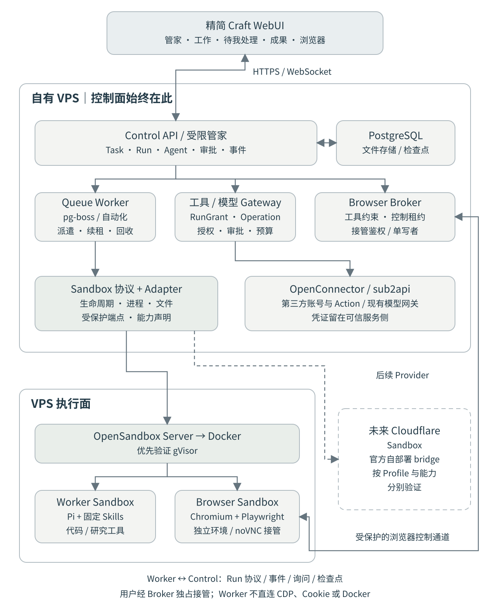

# AgentAnywhere｜产品需求文档（PRD）

版本：v1.0 · 2026-09-18  
状态：建议实施基线；不是已实现功能清单  
范围：个人委托式 Agent WebApp；控制面固定部署于自有 VPS

> 一个管家入口，组织多个可配置 Agent，在隔离环境中完成网络事务；你能够查看过程、补充要求、审批操作、接管浏览器，并保留成果。

## 0. 决策摘要与文档约定

| 决策 | 本版结论 |
| --- | --- |
| 控制面 | 从一开始就在自有 VPS，不以迁移 Cloudflare Workers 为目标。 |
| 主工程 | 从 Craft Agents 建立精简派生工程；复用代码和交互，不保留整套无关产品。 |
| UI/UX | Craft 的布局、消息流、工具卡片、预览和设置交互是统一基准。 |
| Harness | 首版仅 Pi，复用 Craft 的 Pi 集成；保留窄 HarnessAdapter，不建设多 Harness 产品功能。 |
| 执行环境 | 首版 OpenSandbox Server + Docker；项目持有薄 Sandbox 协议，未来接 Cloudflare Sandbox。 |
| 浏览器 | 按需创建独立 Browser Sandbox；Playwright 驱动，noVNC 提供人工接管。 |
| 账号与工具 | OpenConnector 独立运行；主应用统一授权、审批、业务资源约束和回执。 |
| 模型 | sub2api 为唯一模型网关；主应用不重新建设模型路由平台。 |
| 数据与调度 | PostgreSQL 为业务事实源；pg-boss 处理持久任务；成果先存 VPS 文件存储，可替换对象存储。 |
| MVP 边界 | 单用户、单工作空间；一个管家、多个 Agent 定义、有限并发；完成真实端到端闭环。 |

“已核查”指阅读公开源码或官方文档；“设计要求”指本项目拟实现行为；“待验证”指必须通过 MVP 技术验证。上游现有能力不等于本项目已具备。仓库、接口、源码入口及核查日期见附录。

Craft 源码基线为 v0.13.3、提交 `e8963854c3679edcceb105a42537a06749e6cb64`；其根依赖固定 Pi 0.85.1。本次只核查关键入口和依赖，不宣称完成全仓审计或构建验证。Pi 最新主分支文档可能与该固定版本不同，实施时以锁定版本的源码和类型为准。[R01][R02][R06]

## 1. 产品定位、目标与非目标

### 1.1 产品定位

AgentAnywhere 是个人“委托—执行—交付”工作台，不是模型聊天聚合器、容器控制台或可视化工作流编辑器。用户表达目标，管家组织工作；平台用确定性程序约束身份、权限、资源和状态。

核心产品对象是“工作”。Agent 是执行配置，Sandbox 是运行资源，二者不应成为用户每天必须管理的主界面。

### 1.2 核心目标

| 目标 | 产品表现 | 判断方式 |
| --- | --- | --- |
| 降低委托成本 | 通过一个入口提出目标、补充要求、追踪多项工作 | 无须先手工选容器或接线流程即可创建工作 |
| 扩展可执行范围 | 调研、代码、监控、第三方操作和浏览器任务共用工作生命周期 | 新工具或环境无需重新设计任务模型 |
| 维持用户控制 | 具体授权、关键动作审批、运行中取消和人工接管 | 权限由服务端执行，不能仅依赖提示词 |
| 形成可复用成果 | 工作结果独立保存，带来源、版本、验证和外部回执 | 删除沙箱后仍可查看、下载、继续工作 |
| 控制开发与使用成本 | 精简复用、按需沙箱、变化触发、预算与限额 | 不为等人或无变化监控持续推理 |

北极星指标：每周完成且用户认可的有效委托数。辅助指标：成功交付率、人工干预次数、错误外部操作数、任务成本、空闲资源占比。监控“没有变化”也可算正确完成，不以产物数量或 Agent 数量衡量价值。

### 1.3 非目标

首版不做企业多租户、组织 RBAC、收费系统、Agent/Skill 市场、任意 DAG 编辑器、移动原生端、桌面安装器、个人电脑全盘操控、多云自动竞价、完整 IDE、自动绕过验证码、通用网站无监督付款/发布。

不承诺所有网站、所有 OAuth 权限和所有 SaaS Action 都可用；不承诺跨供应商恢复进程内存；不把 Docker、MCP 或 Prompt 当成单独足够的安全边界。

## 2. 用户与关键场景

目标用户为具有自有 VPS、需要把多类网络事务委托给 Agent 的个人。MVP 以单个所有者为唯一角色；运行时所有者标识仍保留，避免未来数据模型无法扩展。

| 场景 | 示例委托 | 交付物 | 用户介入 |
| --- | --- | --- | --- |
| 调研 | 比较某领域三种技术，给出有来源的建议 | 报告、引用、证据文件 | 确认范围、补充偏好 |
| 开发 | 修改指定仓库的一个功能并运行测试 | Patch、文件、测试报告、可选预览 | 需求澄清、审查变更 |
| 持续监控 | 每天检查指定网页或 API，有变化再分析 | 检查记录、差异、必要时报告 | 确认自动化与通知策略 |
| 委托身份操作 | 读取我的指定项目并创建一条已确认内容的记录 | 操作前预览、外部 ID/URL、回执 | 对具体账号、对象和内容审批 |
| 浏览器 | 打开动态网站，筛选信息，下载指定文件 | 摘要、截图、下载文件 | 登录、MFA、验证码、最终提交 |
| 并行工作 | 调研与代码验证分别交给不同 Agent | 子任务结果和管家汇总 | 处理少数阻塞项 |

MVP 不要求一次性支持全部平台。身份操作优先以自有 GitHub 测试仓库做真实验证；社交发布仍是完整产品场景，其具体接入要另行核实平台权限和 Action。

## 3. 信息架构与交互原则

### 3.1 主要导航

| 入口 | 内容 | 不应出现的干扰 |
| --- | --- | --- |
| 管家 | 主对话、工作摘要、快捷委托、全局上下文 | 容器 ID、底层 SDK 选择 |
| 工作 | 全部工作、状态过滤、父子任务、最近更新 | 独立的“Agent 进程管理后台” |
| 待我处理 | 问题、审批、登录、人工接管、异常核查 | 同一事项重复弹窗 |
| 成果 | 报告、代码、文件、外部回执、历史版本 | 将所有工具日志当成果 |
| 自动化 | 持续委托、触发、最近检查、通知状态 | 首版复杂工作流画布 |
| 设置 | Agent、模型连接、账号、Skills、Secrets、环境、资源限额 | 未实现或已裁剪功能的空入口 |

### 3.2 工作详情

延续 Craft 的三部分结构：左侧导航/工作列表，中间对话与活动流，右侧按需打开成果、浏览器或执行详情。小屏折叠为单面板切换，桌面优先，不要求移动端达到桌面全部能力。

活动卡区分“正在执行”“等待你处理”“产物已保存”“外部操作已完成”。流式文本不得制造伪百分比；没有真实进度时显示当前阶段、运行时长和最近事件。

主要动作是补充要求、停止、查看成果、回答、审批和接管。重试必须展示会新建一次执行，已发生的外部操作不会自动重做。

### 3.3 浏览器与预览

浏览器是工作中的按需面板，不是应用内常驻的通用浏览器。无人接管时展示 URL、当前步骤和关键截图；接管时进入真实交互画面，并显著标明“你在操作，Agent 已暂停”。

代码生成的网页预览与有账号登录态的工作浏览器分开；预览置于独立来源，不能共享控制面 Cookie 或直接取得管理 API。

## 4. 核心领域模型

| 对象 | 含义与关键关系 |
| --- | --- |
| Thread | 管家对话或工作对话；不等于任务状态。 |
| Task | 目标、输入、完成条件、父任务、当前状态；可以有多个 Run。 |
| Run | 一次任务执行，固定 Agent/Skill/环境配置版本、授权和预算。 |
| AgentDefinition / Version | 职责、模型、工具上限、Skill 引用、默认环境、交付约束。 |
| SandboxProfile | 逻辑环境配置，如 worker-basic、worker-coding、browser-interactive；不是任意 Docker 参数。 |
| SandboxLease | Run 与实际供应商资源的绑定、角色、租约、续租和回收记录。 |
| Connection | 指向 OpenConnector 中明确账号的引用及安全展示信息。 |
| ModelConnection（模型连接） | 模型网关的端点、凭证引用与可用模型配置；与第三方账号 Connection 分开。 |
| RunGrant | 本次执行可用的账号、Action、资源范围、有效期、浏览器模式和预算。 |
| Interaction | 问题、审批、接管或异常核查；包含等待状态和用户回答。 |
| Operation | 外部副作用的独立记录，包含请求内容哈希、审批、幂等键和回执。 |
| Artifact / Version | 独立于 Run/Sandbox 的成果及版本；正文或文件存储位置、哈希、来源和验证信息。 |
| BrowserSession | 一个 Run 的浏览器实例与控制租约；可引用用户明确授权的登录态版本。 |
| Automation | 触发规则、模板、时区、游标、去重键、通知方式；每次触发产生新的工作或检查。 |

一个 Run 通常分配一个 Worker Sandbox，按需额外分配一个 Browser Sandbox，因此数据关系是 Run 对多个 SandboxLease，而不是永久一对一。

Run 等待后恢复仍可使用同一 Run ID，但执行代次 epoch 增加；失败后由用户重试则创建新 Run，保留 retryOfRunId。模型消息与过程审计不能代替业务数据库。

## 5. 总体架构

图例：实线为首版路径；虚线为未来 Cloudflare 后端。控制面始终在 VPS。图中模块是逻辑边界，不表示每个模块都必须部署一个微服务。

### 5.1 三个平面

| 平面 | 组件 | 职责 |
| --- | --- | --- |
| 交互面 | 精简 Craft WebUI | 会话、工作、成果、审批、浏览器接管、配置 |
| 控制面（VPS） | App/API、管家、Task/Run 服务、队列、Gateway、Browser Broker | 业务状态、调度、权限、持久化、用户交互 |
| 执行面 | OpenSandbox + Docker；未来 Cloudflare Sandbox | 隔离执行 Pi Worker、代码工具、浏览器进程 |

PostgreSQL 保存业务事实和可回放事件；文件存储保存成果与检查点。OpenConnector 保存第三方账号凭证；Secrets 服务保存非连接器机密的加密值。sub2api 的模型路由能力不在本项目中复制。

### 5.2 两条必须独立的协议

Sandbox Protocol 只管理环境生命周期、命令、文件、服务端点和能力。Run/Agent Protocol 负责启动执行、消息、取消、事件、询问和检查点。二者不能合并为“一个远程 shell”。

浏览器另有 BrowserSession/Broker 契约，但复用同一 SandboxProvider 创建环境，不建设第二套容器调度平台。

### 5.3 为什么选择 OpenSandbox

OpenSandbox 已提供生命周期与执行 API、多语言 SDK、Docker/Kubernetes 后端，以及浏览器/桌面环境示例；适合在现有 VPS 部署而不先建立 Kubernetes。[R07][R08]

本项目只接入所需的 Docker 生命周期、命令、文件与端点能力，不将其全部平台概念暴露到 UI。浏览器仍需要项目自己的驱动、接管与授权管理，不能因为有示例就认定已具备完整浏览器产品。

ComputeSDK 不作为首版必需依赖：它的供应商抽象有参考价值，但不能取代本项目的任务授权、浏览器租约和状态语义。Cloudflare 未来直接通过官方自部署 bridge 接入，控制面不用迁移到 Workers。[R10]

安全增强优先验证 OpenSandbox 的 gVisor 接入；不把 gVisor 等同于硬件虚拟机。普通 runc 仅作为显式接受风险的单用户过渡模式；如无法满足隔离要求，应限制不可信负载或将执行面分离，不静默降低安全级别。[R09]

## 6. 管家与任务产品需求

| 编号 | 要求 | 验收行为 |
| --- | --- | --- |
| PRD-01 | 管家识别问答与委托 | 简单问答不强制创建沙箱；工作请求生成可查看 Task |
| PRD-02 | 明确目标与完成条件 | 每项工作保存目标、输入、期望成果；重要缺项可询问 |
| PRD-03 | 选择 Agent 并派遣 | 能按能力和授权选择；用户可覆盖；分配记录可追溯 |
| PRD-04 | 拆分独立子任务 | 子任务各自有状态、执行与成果；父任务不伪装全部成功 |
| PRD-05 | 运行中追加指令 | 显示已接收、何时应用；变更授权需新审批 |
| PRD-06 | 停止与重试 | 停止传播至网关和执行环境；重试不抹掉旧 Run |
| PRD-07 | 统一待办 | 同一 Interaction 仅一份事实，可从主入口或工作详情回答 |
| PRD-08 | 汇总交付 | 汇总引用子任务真实结果，标出失败、不确定和未完成部分 |

管家只能调用受限的任务与查询工具；不得拥有宿主机 shell、任意数据库访问、Docker 管理凭证或修改自己的权限。管家的模型推断与任务状态机分离，模型不能自行将外部操作标为成功。

MVP 子任务仅允许一层，最多三个，用户可看到拆分结果；不做动态递归 Agent 社会。默认有限并发，排队有清晰原因。

## 7. Agent、模型与 Skills

AgentDefinition 必须声明职责、模型连接引用、modelId、推理参数、工具上限、Skills、SandboxProfile、完成条件模板、预算与超时。运行时固定版本，编辑定义不影响正在进行的 Run。

工具范围的界面可读，不要求用户手写每个参数 Schema；优先复用 OpenConnector/MCP 元数据。运行时工具列表按本次授权过滤，未知风险的外部写操作默认要求确认。

Skills 首版通过人工导入目录或文本并固定内容哈希；不自动从互联网安装插件。Skill 是能力与操作说明，不产生额外权限。代码型扩展视为可执行代码，只允许管理员显式批准并固定版本。

模型连接复用 Craft 适用的交互组件，裁掉不用的订阅登录与专属 Provider 流程。正式配置流程为填写 sub2api 端点和凭证、获取模型列表、选择模型与协议、测试连接。模型 ID 手填仅作为网关无法列出模型时的显式备用入口。经 sub2api 验证流式输出、工具调用、多模态、取消和用量；支持未知用量，不把缺失数据展示为零。[R01][R06]

支持 OpenAI Chat Completions（`/v1/chat/completions`）和 Responses（`/v1/responses`）两种协议，协议选择必须贯穿连接测试与实际 Run。模型列表通过服务端调用网关 `GET /v1/models` 获取，浏览器不持有可回读的长期凭证。支持获取和展示模型元信息，包括上下文上限、最大输出、输入模态、工具与推理能力、支持协议及价格；每项标明来源，缺失项保持未知，不根据模型名称猜测。

标准 Models API 不保证提供上述完整能力与价格字段；优先使用网关明确提供的扩展字段或元信息接口，其实际接口和字段映射需在实施前核查。列表可见、协议可用、能力已验证分别记录，不把获取列表成功等同于模型调用成功。参考：[OpenAI Models API](https://developers.openai.com/api/reference/resources/models)。

## 8. 账号、授权、审批与 Secrets

### 8.1 有效授权

有效授权 = 账号实际权限 ∩ Agent 定义权限上限 ∩ 本次任务委托 ∩ 平台与环境策略。账号、动作和资源范围分别管理；不允许不经确认选择另一个“默认账号”。

OpenConnector 的管理 token、bootstrap token 不进入 Agent 环境。Gateway 对每次调用验证 RunGrant、状态、epoch 和具体资源，再以受控凭证调用 OpenConnector。上游连接权限的空列表可能表示“不限制”，本项目不能将空列表误认为“无权限”。[R15]

### 8.2 审批

| 级别 | 行为 |
| --- | --- |
| 读取与本地计算 | 在既定授权内自动执行；沙箱内文件变更不等于第三方账号变更 |
| 已知外部写入 | 展示账号、目标、内容、附件、风险，确认后执行固定参数 |
| 发布、删除、权限变化等 | 默认逐次确认；MVP 不做模糊的一次性全权授权 |
| 状态不明 | 停止自动重试，展示核查事项，不把未知当失败再执行 |

审批绑定 operationId、参数规范化哈希、账号、资源、授权版本与过期时间。审批后内容改变即失效。重复点击审批只能产生一次授权消费记录。

OpenConnector HTTP Action 支持幂等键，但不能因此承诺上游恰好执行一次。平台必须保存操作状态、回执与核查策略。[R15]

### 8.3 机密管理

普通配置、执行机密、OAuth 连接和浏览器登录态在一个设置入口呈现，底层分开存储。机密使用成熟加密库与独立部署主密钥；数据库、备份与主密钥分离，不自行发明加密算法。

能运行 shell 的 Agent 可能读取同环境变量、文件和进程内容。因此优先把长期 API Key、私钥留在可信 Gateway/代理中；必须交给沙箱的机密应被视为已委托给该 Run。不存在“写进环境变量就对 Agent 不可见”的保证。

秘密管理页支持新增、替换、停用、引用范围和最近使用记录；不回显已有明文。模型 Prompt、日志、Artifacts、普通工作目录归档不得主动包含长期密钥、Cookie 或 OAuth refresh token。

## 9. 浏览器产品需求

### 9.1 采用的实现路线

使用独立 Browser Sandbox 运行 Chromium、Playwright 及按需交互显示环境。Browser Broker 是受信任服务，负责会话、工具过滤、接管租约和端点访问；Agent Worker 只取得受限浏览器工具，不取得 CDP、VNC、Cookie 文件或浏览器容器 shell。

优先复用 Playwright 与官方 MCP 的工具/快照能力，不引入另一套独立浏览器 Agent 决策循环。noVNC 只解决画面与键鼠接管，不负责模型推理和安全审批。[R11][R14]

浏览器任务与代码工作都由 Pi 协调。自生成应用测试可使用匿名浏览器与指定预览地址；具有真实身份的浏览器必须与任意代码环境隔离。

### 9.2 能力与上线阶段

| 能力 | MVP | 后续 |
| --- | --- | --- |
| 公开动态页面 | 导航、观察、截图、提取、受控交互、下载 | 更复杂跨站工作流 |
| 用户可见进度 | 当前 URL、步骤、关键截图、下载产物 | 更丰富回放 |
| 人工接管 | 暂停 Agent、用户操作、恢复前确认 | 多终端交接 |
| 登录/MFA/验证码 | 由用户在独立浏览器中完成，不把密码交给模型 | 已审核站点的有限授权恢复 |
| 登录态持久化 | 默认不跨 Run 保留；预留加密引用模型 | 明确授权后保存、过期、撤销、独占租约 |
| 已登录账号写入 | 最终提交由用户接管完成，或改走已审批连接器 Action | 站点专用、确定性写入适配 |
| 自然语言任意网站无人监督写入 | 不提供 | 不作通用可靠性承诺 |

“MVP 支持浏览器”不是承诺任何网站都能自动完成。网站可能禁止自动化或要求设备绑定；登录态无法恢复时必须重新登录，不通过规避机制强行继续。

### 9.3 安全与交互规则

接管状态只能有一个控制者。用户接管前 Broker 停止接收新的 Agent 浏览器动作，等待或取消在途操作；返回 Agent 前重新获取页面状态，旧元素引用作废。

登录/MFA 输入阶段默认暂停录屏、截图和 DOM 采集；用户结束接管后恢复。历史截图和下载可能含隐私，应按敏感成果管理，不能宣称自动脱敏覆盖所有页面。

不得把 MCP 的 allowed-origins 当作网络防火墙；其官方说明并不构成安全边界。网络层须限制内网、元数据地址、控制面和跨 Run 服务，处理 DNS、重定向及 WebSocket 等路径。[R11]

默认官方 Playwright Docker 镜像以 root 运行会关闭 Chromium sandbox；正式浏览任务应使用经验证的非 root 配置与兼容的安全配置，不能照搬开发模式的 --no-sandbox、host IPC 或高权限参数。[R12]

## 10. Sandbox 产品与扩展契约

| 要求 | 产品规则 |
| --- | --- |
| 环境选择 | 用户选择逻辑 Profile；管理员配置可用后端和镜像映射 |
| 生命周期 | 创建、准备、可用、回收、失联、清理失败均可追踪 |
| 资源 | CPU、内存、磁盘、最长运行时间、并发、浏览器会话数有上限 |
| 能力 | Provider 明示 command/files/serviceEndpoint/renew 等能力；终端、快照、桌面为可选 |
| 恢复 | Session + 工作目录 + Operation 状态恢复；不默认恢复内存和浏览器活跃连接 |
| 数据位置 | 默认 VPS；云执行和数据外移需显式授权，不自动回退云端 |
| 回收 | 先保存成果、检查点与必要日志，再销毁；失败进入清理队列 |
| 节点扩展 | 可注册更多 OpenSandbox Endpoint；不要求 Agent 访问 Docker daemon |

云端适配只保证经过契约测试的能力；Cloudflare 的镜像、端口、长进程和浏览器支持必须各自验证，不能默认同一个 Docker 参数对象可直接使用。[R10]

## 11. 生命周期与异常规则

### 11.1 工作状态

Task 对用户展示：待执行、执行中、等你处理、部分完成、已完成、失败、已取消。Task 的完成由完成条件和子任务结果决定，不简单等于最后一条聊天消息。

Run 内部状态：queued → provisioning → running → waiting → running → finalizing → succeeded；异常进入 failed、cancelled 或 lost。waiting 附带 question/approval/handoff/auth/reconcile 原因。

> 图 2：执行与审批流程图尚未提供；当前以正文流程和状态定义为准。

### 11.2 关键异常

| 异常 | 必须行为 |
| --- | --- |
| 模型限流或临时错误 | 有限重试、显示重试过程；不重复已成功工具副作用 |
| Worker 断连 | 先检查租约和实例，不立即派第二个并发副本 |
| VPS 重启 | 从数据库恢复待办、排队和运行状态，核对实际沙箱 |
| 用户长时间不回答 | 保存安全检查点并释放计算；浏览器可能需重开与重新登录 |
| 外部操作超时 | 标记 unknown；依据回执/上游查询核查，不盲目再执行 |
| 文件保存失败 | 不宣称交付完成；保留现场并提示修复 |
| 取消与操作执行竞态 | 撤销未开始动作；已提交上游的动作不可保证撤回，显示真实回执 |
| 沙箱销毁失败 | 任务结果与清理状态分开显示，后台重试并告警 |

## 12. 成果、过程与自动化

成果至少支持 Markdown、普通文件、代码 Patch、图片和外部回执。成果由显式提交生成，保存类型、版本、hash、来源 Run、验证结果、引用和下载入口。一个失败 Run 也可产生有用的部分成果，但不得标成完整交付。

过程默认保存用户消息、可见模型输出、工具活动、审批、外部回执和执行状态；不要求获取模型未提供的内部推理。大体积日志与文件不进入数据库消息正文。

自动化通过定时或事件触发短任务。优先以确定性方式检查变化、去重和预算，再调用 Agent 分析。MVP 支持定时与站内通知；Webhook 和外部通知渠道为后续能力。

自动化必须保存显式时区、最近触发/下次触发、模板版本、检查游标和失败记录；不按聊天语言猜时区。定时写操作沿用审批策略，不因“自动化”而绕过。

## 13. Craft 复用与裁剪原则

W0 部署的原生 Craft 页面仅用于兼容性验证。正式 Web 按本产品的信息架构建立精简派生工程，按实际依赖提取适用组件；原生导航、功能全集和配置流程不作为产品验收基准。

Craft 当前 WebUI 仍通过浏览器适配器设置 window.electronAPI 并加载 Electron renderer，因此不能先删除整个 apps/electron 再做迁移。[R03][R04]

| 分类 | 处理 |
| --- | --- |
| 保留与抽取 | 共享样式、UI、消息与工具卡、预览、输入框、适用的快捷键、Pi 事件适配、模型连接配置 |
| 改造后保留 | renderer → 独立 Web 模块；Platform/API 适配；Session 展示与业务 Run 映射；设置、认证和文件访问 |
| 物理删除 | Electron main/preload/打包签名/更新器；无关桌面系统能力；公开 Viewer/分享服务；无关消息渠道；不用的 Harness 和 Provider 专属登录 |
| 审核后决定 | 附件解析、文档预览、终端、自动化实现、i18n 基础、遥测依赖；依据实际依赖闭包处理 |
| 新增 | Task/Run/Grant/Operation、Sandbox Adapter、Browser Broker、统一成果与调度逻辑 |

裁剪必须覆盖源码、路由、菜单、服务端处理器、构建脚本、依赖和安装镜像。保留一个隐藏入口、让未用 SDK 随安装下载，不算完成裁剪。

暂存的兼容适配层必须有去除条件。MVP 发布门槛包括：浏览器构建不依赖 Electron 运行时；服务端不存在宿主机 Agent shell 路径；产品专属的无用直接依赖已去除。通用 Pi 包内的传递依赖不应为追求“零字节”而破坏上游结构。

## 14. 非功能需求与使用成本

本节数值为建议验收目标，不是实测性能。VPS 规格未知，上线前必须容量测量。

| 维度 | 目标 |
| --- | --- |
| 响应 | 创建任务接口在正常本地负载下 p95 ≤ 1 秒；不包含模型和冷启动 |
| 实时性 | 已接收 Worker 事件到前端展示 p95 ≤ 2 秒 |
| 取消 | 2 秒内确认请求；Gateway 5 秒内拒绝新动作；30 秒内执行强制停止流程 |
| 恢复 | 重启后 60 秒内启动运行资源核对；不可恢复的任务明确提示 |
| 一致性 | 重复派遣、重复事件、重复审批不产生第二个有效执行者或第二次授权消费 |
| 容量 | 默认一个 Worker Run + 一个按需 Browser Session；提高并发前检测内存、CPU和磁盘余量 |
| 预算 | 每 Run 限时、限轮次、限 tokens；模型实际费用有数据才显示，估算须标记 |
| 保留 | 默认成果 90 天、运行日志 30 天、关键审计 180 天；可配置，涉及删除应提示 |
| 运维 | 有健康检查、迁移、备份、恢复演练、失联与清理失败告警 |
| 可用性 | 单 VPS 存在单点故障，不承诺高可用 SLA |

成果保存时须说明到期策略并允许“长期保留”。Secrets 与浏览器状态不随普通成果归档。备份不能包含同一位置的解密主密钥。

## 15. 完整产品到 MVP 的范围映射

| 能力 | MVP 必须 | 后续扩展 |
| --- | --- | --- |
| 管家与工作 | 创建、委派、查询、追加、取消、汇总 | 复杂计划调整、更多任务类型 |
| Agent | 定义、版本、模型、工具、Skills、默认环境 | 多 Harness 与更多资源配置 |
| 任务组织 | 一层子任务，有限并发 | 复杂依赖与长期协同 |
| 沙箱 | 一个 OpenSandbox/Docker Endpoint，协议契约与清理 | Cloudflare 实际后端、更多节点、可选强隔离 |
| 浏览器 | 匿名操作、独立环境、截图/下载、人工接管 | 经授权登录态复用、站点专用写入 |
| 账号 | 至少一个真实平台读取与审批写入闭环 | 更多平台与社交网络 |
| 自动化 | 定时、变化检测、去重、站内通知 | Webhook、外部通知 |
| 成果与恢复 | 独立保存、过程回放、安全检查点续跑 | 更丰富编辑与协作 |
| UI/代码 | 实际裁剪的 Craft 派生 WebApp | 不以重新塞回所有 Craft 功能为演进目标 |

## 16. 风险、假设与发布判断

重要假设：个人单用户、Linux VPS 可运行 Docker、有可用域名和 TLS、sub2api 提供兼容端点。硬件架构、资源规格、可用隔离运行时、具体第三方平台权限未知，属于部署前检查，不改变既定产品方向。

主要风险是 Craft 的桌面依赖比目录显示更深、Pi 版本升级破坏事件接口、浏览器与安全运行时兼容性、网站风控与登录态失效、跨进程故障导致外部副作用重复，以及无边界的镜像/日志增长。

发布判断不使用“聊天能运行”作为标准。必须通过：委托调研、代码执行、浏览器接管、账号审批写入、周期监控、断线恢复、取消、权限隔离和物理裁剪九类验证。具体任务包、协议与验收用例见 MVP 文档。

## 附录 A. 一手来源与复用依据

本附录为来源登记；正文的 [Rxx] 指向相应条目。访问日期均为 2026-09-18。除注明提交外，main/官网内容可能继续变化；开工时需锁定具体 release、commit 和镜像 digest。

[R01] Craft Agents 根配置与依赖：<https://github.com/craft-ai-agents/craft-agents-oss/blob/e8963854c3679edcceb105a42537a06749e6cb64/package.json>。

[R02] Craft 源码基线：<https://github.com/craft-ai-agents/craft-agents-oss/commit/e8963854c3679edcceb105a42537a06749e6cb64>。

[R03] Craft WebUI 入口：<https://github.com/craft-ai-agents/craft-agents-oss/blob/e8963854c3679edcceb105a42537a06749e6cb64/apps/webui/src/App.tsx>。

[R04] Craft WebUI 构建与共享 renderer：<https://github.com/craft-ai-agents/craft-agents-oss/blob/e8963854c3679edcceb105a42537a06749e6cb64/apps/webui/vite.config.ts>。

[R05] Craft Pi 子进程与事件适配入口：<https://github.com/craft-ai-agents/craft-agents-oss/blob/e8963854c3679edcceb105a42537a06749e6cb64/packages/shared/src/agent/backend/pi/index.ts>。

[R06] Pi 官方 SDK 文档：<https://github.com/earendil-works/pi/blob/main/packages/coding-agent/docs/sdk.md>。仅说明 SDK 能力方向，具体调用以固定版本为准。

[R07] OpenSandbox 概述与运行时：<https://github.com/opensandbox-group/OpenSandbox>。

[R08] OpenSandbox API 说明：<https://github.com/opensandbox-group/OpenSandbox/blob/main/docs/api/index.md>。

[R09] OpenSandbox 安全运行时接入：<https://github.com/opensandbox-group/OpenSandbox/blob/main/docs/guides/secure-container.md>。

[R10] Cloudflare 官方自部署 Sandbox bridge：<https://developers.cloudflare.com/sandbox/bridge/>。

[R11] Microsoft Playwright MCP：<https://github.com/microsoft/playwright-mcp>。包含浏览器工具、CDP 连接、隔离配置与安全边界说明。

[R12] Playwright Docker 官方说明：<https://playwright.dev/docs/docker>。

[R13] Playwright 登录状态：<https://playwright.dev/docs/auth>。

[R14] noVNC：<https://github.com/novnc/noVNC>。

[R15] OpenConnector Runtime API：<https://github.com/oomol-lab/open-connector/blob/main/docs/runtime-api.md>。

[R16] pg-boss：<https://github.com/timgit/pg-boss>。

[R17] Craft 共享 UI 平台适配：<https://github.com/craft-ai-agents/craft-agents-oss/blob/e8963854c3679edcceb105a42537a06749e6cb64/packages/ui/src/context/PlatformContext.tsx>。

[R18] Craft 共享 UI 包：<https://github.com/craft-ai-agents/craft-agents-oss/blob/e8963854c3679edcceb105a42537a06749e6cb64/packages/ui/package.json>。
